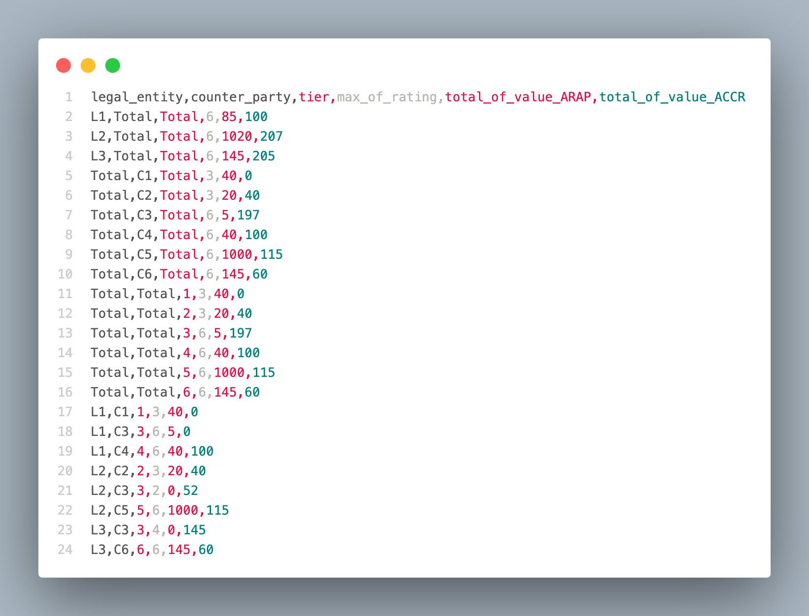
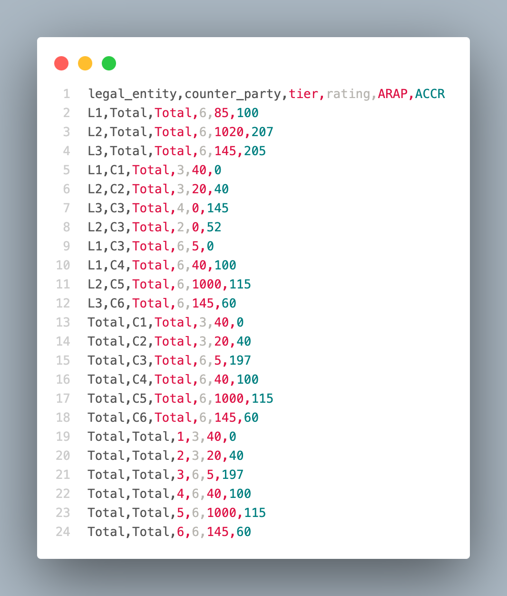

## Getting Started

### Prerequisites

- Python3
- pip

### To set up a virtual environment and activate it, follow these steps:

#### Install virtualenv using pip

```bash
python3 -m pip install virtualenv
```

#### Create a virtual environment

```bash
virtualenv env
```

#### Activate the virtual environment (Mac)

```bash
source env/bin/activate
```

#### Activate the virtual environment (Windows)

```bash
env\Scripts\activate
```

## Folder Structure

- #### inputs: Contains input data files.
  - [inputs/dataset1.csv](inputs/dataset1.csv)
  - [inputs/dataset2.csv](inputs/dataset2.csv)
- #### outputs: This is where the output files will be generated.

  (Note: Once output files are generated, access them here.)

  - [outputs/apache_output.csv-00000-of-00001](./outputs/apache_output.csv-00000-of-00001)
  - [outputs/pandas_output.csv](./outputs/pandas_output.csv)

- [src/apache_beam_sol.py](src/apache_beam_sol.py) - The script for data processing using Apache Beam.
- [src/pandas_sol.py](src/pandas_sol.py) - The script for data processing using Pandas.
- [README.md](./README.md) - This README file.
- [requirements.txt](./requirements.txt) - contains the required Python packages.
- [logs.log](./logs.log) - log file

## Installing Required Packages

To install the required packages from the requirements.txt file, run the following command:

```bash
pip install -r requirements.txt
```

## Commands

To Execute Files

```bash
python src/apache_sol.py;
python src/pandas_sol.py;
```

## Output

The resulting CSV files _apache_output.csv_ and _pandas_output.csv_ can be found in outputs directory. If we run scripts multiple time, it will overwrite the output files.

## Screenshots

**1. result_pandas.csv** : Contains the processed data after using the Pandas framework.


**2. result_apache_beam.csv** : Contains the processed data after using the Apache Beam framework.

